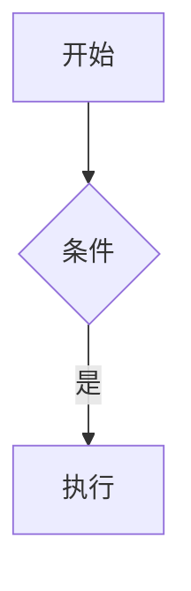
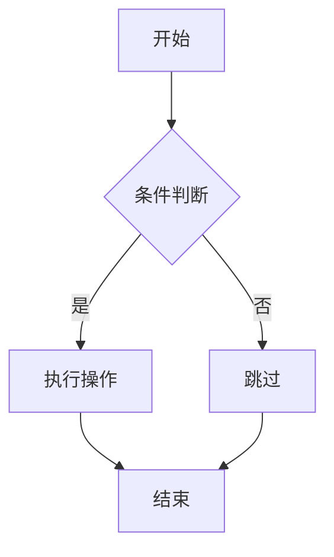
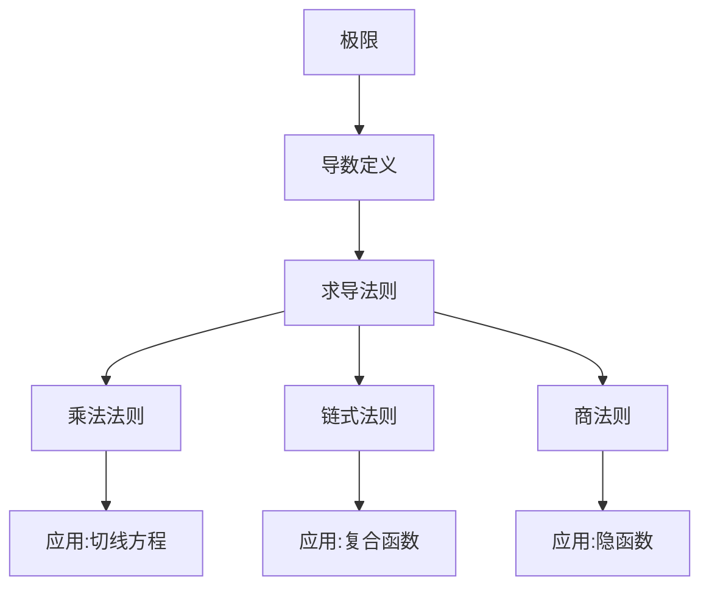

# UniDoc 仓库 AI 操作指南

> 本文件供 AI agent 阅读。用户将本文件放在 UniDoc vault 根目录后，AI agent（如 Cursor / Trae / Claude Desktop 等支持文件访问的工具）读取本文件即可直接操作整个仓库的 `.md` 文件，无需打开 UniDoc 软件。
>
> **核心原则：** UniDoc 的全部功能都能通过纯文本编辑 `.md` 文件实现。AI 只需按本文件规则读写 `.md`，用户在 UniDoc 中打开即可看到效果。

---

## 0. UniDoc 是什么

UniDoc 是一个块级 Markdown 编辑器（类似 Obsidian/Typora）。用户的文档以标准 `.md` 文件存储在 vault（仓库）文件夹中。

**关键事实：**
- 所有文档都是纯文本 `.md` 文件，可直接用任何文本编辑器/AI 修改
- 图片存在文档所在目录的 `assets/` 子文件夹
- AI 修改 `.md` 文件后，用户在 UniDoc 打开自动识别新内容
- UniDoc 的扩展语法（分页符、Mermaid、HTML、公式）都是纯文本，AI 直接写

---

## 1. 绝对规则（不可突破）

### 1.1 文件操作规则

1. **只操作 `.md` 文件**，不要创建 `.txt` / `.docx` / 其他格式
2. **新建文件必须指定路径**，如 `笔记/数学笔记.md`
3. **文件名避免特殊字符**，用中文/英文/数字/连字符，不用 `/\:*?"<>|`
4. **保留 frontmatter**：若文件顶部有 `---` 包裹的元信息，修改时不要破坏
5. **不要动 `assets/` 文件夹**：图片资源由用户通过 UniDoc 界面管理，AI 只读不写

### 1.2 图片路径规则（重要）

图片路径**相对文档所在目录**：

- 文档 `笔记/数学笔记.md` 引用图片 → 路径写 `assets/xxx.png`（解析为 `笔记/assets/xxx.png`）
- 文档 `欢迎文档.md`（根目录）引用图片 → 路径写 `assets/xxx.png`（解析为 `assets/xxx.png`）
- **AI 不要自行复制/移动图片文件**，只引用已存在的图片路径
- 若需引用新图片，提示用户在 UniDoc 中插入图片后自动落到 `assets/`

### 1.3 块结构规则

UniDoc 是**块结构**编辑器，块之间**必须空一行**：

```markdown
第一段内容

第二段内容
```

**不要这样写**（会被合并成一段）：
```markdown
第一段内容
第二段内容
```

---

## 2. 文件结构

每个 `.md` 文件结构：

```
[可选 frontmatter]

[块1]

[块2]

...
```

### 2.1 Frontmatter（YAML 元信息）

文件顶部可选 `---` 包裹的元信息：

```yaml
---
title: 文档标题
author: 作者
version: 1.0.0
created_at: 2026-07-04T10:00:00Z
updated_at: 2026-07-04T12:00:00Z
tags: [数学, 笔记]
---

正文开始...
```

**AI 修改文件时：**
- 若文件有 frontmatter，保留并按需更新 `updated_at` / `tags`
- 若文件无 frontmatter，不强制添加（用户未设置时留空）
- `updated_at` 用 ISO 时间戳，如 `2026-07-04T12:00:00Z`

---

## 3. 块级语法（9 种块类型）

### 3.1 标题

```markdown
# 一级标题
## 二级标题
### 三级标题
#### 四级标题
##### 五级标题
###### 六级标题
```

- 1–6 个 `#` + **一个空格** + 标题文本
- 标题支持行内样式（粗体/链接等）

### 3.2 段落

普通文本。连续行会合并为一段（空格连接），**段落间必须空行**。

### 3.3 引用

```markdown
> 引用内容,支持 **行内样式**。
```

- `>` + 空格 + 内容
- **不支持嵌套引用**（`>>` 当普通段落）

### 3.4 列表

**无序列表：**
```markdown
- 项目一
- 项目二
- 项目三
```
触发符：`- ` / `* ` / `+ `（建议统一用 `-`）

**有序列表：**
```markdown
1. 第一项
2. 第二项
3. 第三项
```

**任务列表：**
```markdown
- [ ] 未完成项
- [x] 已完成项
```

- **不支持缩进子列表**（缩进项会被当作普通段落）
- 同一列表内类型必须一致

### 3.5 代码块

````markdown
```plaintext
普通代码
```


````

- 三反引号围栏，语言标识紧跟无空格
- **代码块内内容原样保留**，不解析任何语法
- **mermaid 特殊**：UniDoc 会渲染为 SVG 图表

### 3.6 表格

```markdown
| 列一 | 列二 | 列三 |
| --- | --- | --- |
| a | b | c |
| d | e | f |
```

- 第一行表头，第二行 `| --- |` 分隔，第三行起数据
- 单元格支持行内样式
- **不支持合并单元格**、不支持表格内换行

### 3.7 图片

**Obsidian 语法（带宽度，推荐）：**
```markdown
![[assets/photo.png|480]]
![[assets/photo.png]]
```

**标准 Markdown 语法（无宽度）：**
```markdown

```

- 路径相对文档所在目录
- 有宽度用 `![[]]`，无宽度用 `` 保留 alt

### 3.8 分隔线

```markdown
---
```

三个或更多 `-`。

### 3.9 分页符

```markdown
---page---
```

- **固定字面量** `---page---`，区分大小写
- 演示模式下作为幻灯片边界
- **不要写成** `--- page ---` 或 `---Page---`

---

## 4. 行内样式

### 4.1 基础样式

| 样式 | 语法 | 示例 |
|---|---|---|
| 粗体 | `**text**` | `**重点**` |
| 斜体 | `*text*` | `*强调*` |
| 删除线 | `~~text~~` | `~~废弃~~` |
| 行内代码 | `` `code` `` | `` `print()` `` |
| 下划线 | `<u>text</u>` | `<u>下划线</u>` |
| 高亮 | `==text==` | `==关键==` |
| 上标 | `^text^` | `x^2^` |
| 下标 | `~text~` | `H~2~O` |

**注意：**
- `~~` 优先于 `~`（删除线 vs 下标）
- `**` 优先于 `*`（粗体 vs 斜体）
- 行内代码内不解析任何语法

### 4.2 链接与图片

```markdown
[链接文本](https://example.com)


```

- 链接文本内可嵌套行内样式：`[**加粗链接**](url)`
- 裸 URL（`http(s)://`）自动转链接

### 4.3 数学公式（KaTeX）

**行内公式：**
```markdown
$E=mc^2$
```
- `$` 后必须非空白，闭合 `$` 前必须非空白
- 不能跨行

**块级公式：**
```markdown
$$\int_0^1 x^2\,dx = \frac{1}{3}$$
```
- `$$` 包裹，可跨行
- 用 KaTeX 语法

---

## 5. HTML 标签（Obsidian 兼容）

UniDoc 支持白名单 HTML 标签直接写在 Markdown 中。**只有下列标签会被解析**，其他当纯文本。

### 5.1 行内标签

`b` `i` `s` `del` `mark` `sub` `sup` `kbd` `code` `span` `font` `center` `cite` `q` `small` `big` `tt` `u` `abbr` `dfn` `time` `a` `em` `strong` `var` `samp` `data` `bdi` `bdo` `ruby` `rt` `rp` `label` `output`

### 5.2 块级标签

`p` `div` `details` `summary` `dl` `dt` `dd` `figure` `figcaption` `ul` `ol` `li` `pre` `blockquote` `section` `article` `header` `footer` `nav` `aside` `main` `h1`–`h6`

### 5.3 表格标签

`table` `thead` `tbody` `tfoot` `tr` `td` `th` `caption` `colgroup`

### 5.4 交互标签

`progress` `meter`（进度条/度量条）

### 5.5 自闭合标签

`br` `hr` `img` `wbr` `area` `base` `col` `embed` `input` `link` `meta` `source` `track`

### 5.6 属性白名单

`href` `src` `alt` `title` `class` `style` `id` `name` `color` `size` `face` `align` `width` `height` `target` `rel` `datetime` `cite` `lang` `dir` `colspan` `rowspan` `start` `type` `value` `open` `role` `aria-label` `aria-hidden` `data-type` `min` `max` `low` `high` `optimum` `checked` `for` `placeholder` `readonly` `disabled` `required` `autocomplete` `autofocus` `tabindex` `accesskey` `border` `cellpadding` `cellspacing` `scope` `headers` `abbr` `nowrap` `bgcolor` `valign` `background` `frame` `rules` `span`

### 5.7 常用 HTML 示例

**键盘键：**
```markdown
<kbd>Ctrl</kbd>+<kbd>S</kbd> 保存
```

**折叠块：**
```markdown
<details>
<summary>点击展开详情</summary>

折叠内容支持 **粗体** 等行内样式。

</details>
```

**进度条：**
```markdown
<progress value="70" max="100"></progress>
```

**彩色文字：**
```markdown
<span style="color:red">红色文字</span>
<span style="color:#3b82f6">蓝色文字</span>
```

**定义列表：**
```markdown
<dl>
<dt>术语</dt>
<dd>定义内容</dd>
<dt>另一个术语</dt>
<dd>另一个定义</dd>
</dl>
```

### 5.8 HTML 限制

- `javascript:` 协议被移除
- `href` 中的 `data:` 被移除
- `on*` 事件属性全部被过滤
- 白名单外标签当纯文本

---

## 6. AI 操作场景指南

### 6.1 生成新文档

**模板：**
```markdown
---
title: 文档标题
author: 用户名
version: 1.0.0
created_at: 2026-07-04T10:00:00Z
updated_at: 2026-07-04T10:00:00Z
tags: [标签1, 标签2]
---

# 文档标题

正文内容...
```

**AI 操作步骤：**
1. 确定文件路径（如 `笔记/数学笔记.md`）
2. 按上述模板生成内容
3. 块间空行分隔
4. 保存到 vault

### 6.2 修改现有文档

**AI 操作步骤：**
1. 读取目标 `.md` 文件
2. 保留 frontmatter（若存在）
3. 按用户要求修改正文（增删块、改样式、加图表等）
4. 若内容有实质变化，更新 frontmatter 的 `updated_at`
5. 保存

**注意：**
- 不要随意增删块间空行（会导致块合并/分裂）
- 不要改图片路径为绝对路径
- HTML 标签必须正确闭合
- 代码块内不要出现 ``` 字符

### 6.3 批量整理仓库

**AI 可执行的操作：**
- 重命名 `.md` 文件（用户要求时）
- 移动 `.md` 文件到其他文件夹
- 删除 `.md` 文件（用户明确要求时）
- 创建新文件夹
- 批量更新 frontmatter（加 tags、改 title 等）

**AI 不可执行：**
- 不要动 `assets/` 文件夹里的图片
- 不要修改非 `.md` 文件
- 不要删除用户未明确要求的文件

**移动文件时注意：** 若文档含图片引用，移动文档后图片路径可能失效（路径相对文档目录）。移动后需检查并提示用户。

### 6.4 生成 Mermaid 图表

AI 可直接在文档中写 mermaid 代码块：

````markdown

````

**支持的图表类型：** flowchart / sequence / class / state / ER / gantt / pie 等 Mermaid 全系列。

### 6.5 生成数学公式

**行内公式：**
```markdown
质能方程 $E=mc^2$ 描述了质能等价。
```

**块级公式：**
```markdown
$$
\frac{d}{dx}\left(\int_0^x f(t)\,dt\right) = f(x)
$$
```

**常用公式示例：**

| 场景 | 语法 | 效果 |
|---|---|---|
| 分数 | `\frac{a}{b}` | a/b |
| 上标 | `x^2` | x² |
| 下标 | `x_i` | xᵢ |
| 根号 | `\sqrt{x}` | √x |
| 求和 | `\sum_{i=1}^{n} x_i` | Σ |
| 积分 | `\int_0^1 x\,dx` | ∫ |
| 极限 | `\lim_{x \to 0}` | lim |
| 矩阵 | `\begin{pmatrix}a&b\\c&d\end{pmatrix}` | 矩阵 |

### 6.6 生成 HTML 扩展内容

**折叠详情（适合长文档）：**
```markdown
<details>
<summary>点击查看详细推导</summary>

$$
\int_0^1 x^2\,dx = \frac{1}{3}
$$

</details>
```

**进度条（适合任务追踪）：**
```markdown
项目进度：<progress value="70" max="100"></progress> 70%
```

**键盘快捷键说明：**
```markdown
按 <kbd>Ctrl</kbd>+<kbd>S</kbd> 保存，<kbd>Ctrl</kbd>+<kbd>Z</kbd> 撤销。
```

**彩色标注：**
```markdown
<span style="color:red">重点</span> 和 <span style="color:green">次要</span> 内容。
```

---

## 7. 完整文档示例

````markdown
---
title: 高中数学笔记 - 导数
author: 学生
version: 1.0.0
created_at: 2026-07-04T10:00:00Z
updated_at: 2026-07-04T15:30:00Z
tags: [数学, 导数, 高三]
---

# 导数

## 基本定义

导数是函数在某一点的**瞬时变化率**，记作 $f'(x)$ 或 $\frac{dy}{dx}$。

$$
f'(x) = \lim_{\Delta x \to 0} \frac{f(x + \Delta x) - f(x)}{\Delta x}
$$

## 常用求导公式

| 函数 | 导数 |
| --- | --- |
| $c$（常数） | $0$ |
| $x^n$ | $nx^{n-1}$ |
| $\sin x$ | $\cos x$ |
| $\cos x$ | $-\sin x$ |
| $e^x$ | $e^x$ |
| $\ln x$ | $\frac{1}{x}$ |

## 求导法则

### 乘法法则

$$
(uv)' = u'v + uv'
$$

### 链式法则

若 $y = f(g(x))$，则：

$$
\frac{dy}{dx} = f'(g(x)) \cdot g'(x)
$$

## 典型例题

> 求 $y = (3x^2 + 1)^5$ 的导数。

<details>
<summary>查看解答</summary>

设 $u = 3x^2 + 1$，则 $y = u^5$。

由链式法则：

$$
\frac{dy}{dx} = 5u^4 \cdot u' = 5(3x^2 + 1)^4 \cdot 6x = 30x(3x^2 + 1)^4
$$

</details>

## 知识脉络



## 学习进度

- [x] 理解导数定义
- [x] 掌握基本求导公式
- [x] 乘法法则
- [ ] 链式法则（复习中）
- [ ] 隐函数求导

掌握度：<progress value="60" max="100"></progress> 60%

---

## 相关链接

- [高一函数复习](函数基础.md)
- [积分笔记](积分.md)

---page---

# 附录：练习题

1. 求 $y = x^3 + 2x^2 - 5x + 1$ 的导数。
2. 求 $y = \sin(2x)$ 的导数。
3. 求 $y = e^{x^2}$ 的导数。
````

**说明：**
- `---page---` 把文档分为两页，演示模式下作为两张幻灯片
- `---`（三个连字符）是分隔线
- frontmatter 的 `tags` 便于分类检索

---

## 8. AI 操作检查清单

修改/创建 `.md` 文件后，AI 应自检：

- [ ] 文件扩展名是 `.md`
- [ ] 块间有空行分隔
- [ ] frontmatter（若有）格式正确，`---` 包裹
- [ ] 图片路径相对文档所在目录（`assets/xxx.png`）
- [ ] 代码块围栏正确闭合（``` 配对）
- [ ] HTML 标签正确闭合
- [ ] mermaid 语法正确（若使用）
- [ ] 数学公式 `$` / `$$` 配对正确
- [ ] 分页符是 `---page---`（不是 `--- page ---`）
- [ ] 表格分隔行是 `| --- |`（至少 3 个 `-`）
- [ ] 列表项前缀正确（`- ` / `1. ` / `- [ ] `）

---

## 9. 常见错误

| 错误 | 后果 | 正确写法 |
|---|---|---|
| 块间不空行 | 多行合并为一段 | 块间空一行 |
| `#标题` 无空格 | 当作普通段落 | `# 标题` |
| `>text` 无空格 | 不识别为引用 | `> text` |
| `--- page ---` 带空格 | 当作分隔线 | `---page---` |
| 图片用绝对路径 | 渲染失败 | 用相对路径 `assets/xxx.png` |
| 代码块内含 ``` | 代码块提前结束 | 避免或用 4 个反引号围栏 |
| `~text~` 当删除线 | 单 `~` 是下标 | 删除线用 `~~text~~` |
| HTML 标签未闭合 | 反序列化收集到文档末尾 | 确保 `<tag>...</tag>` 配对 |
| 表格只有 1 行 | 不识别为表格 | 至少表头 + 分隔行 + 1 数据行 |
| frontmatter 后不空行 | 正文被吞 | frontmatter `---` 后空一行 |

---

## 10. 用户与 AI 协作流程

### 10.1 推荐工作流

1. **用户**：在 UniDoc 中正常编辑文档
2. **用户**：需要 AI 协助时，用 AI 工具打开 vault 文件夹
3. **AI**：读取本指南 + 目标 `.md` 文件
4. **AI**：按用户要求修改文件（遵循本指南规则）
5. **用户**：在 UniDoc 中看到修改结果（自动热保存不影响 AI 修改的文件）

### 10.2 典型场景示例

**场景 1：用户说"帮我生成一份高中物理力学笔记"**
```
AI 操作:
1. 创建文件 `笔记/物理/力学笔记.md`
2. 按 §6.1 模板生成 frontmatter
3. 写入标题、正文、公式、图表
4. 保存
用户在 UniDoc 打开即可看到完整笔记
```

**场景 2：用户说"给我的数学笔记加一个目录"**
```
AI 操作:
1. 读取 `笔记/数学笔记.md`
2. 扫描所有 # ## ### 标题
3. 在文件顶部(frontmatter 后)插入目录段落:
   ## 目录
   - [第一章](#第一章)
   - [第二章](#第二章)
4. 保存
```

**场景 3：用户说"把所有未完成的任务集中到一个清单"**
```
AI 操作:
1. 扫描仓库所有 .md 文件
2. 收集所有 - [ ] 未完成项
3. 创建 `待办清单.md`
4. 按来源文件分类列出
5. 保存
```

**场景 4：用户说"给这篇笔记画个知识结构图"**
```
AI 操作:
1. 读取目标文档
2. 分析内容结构
3. 生成 mermaid 代码块插入文档末尾:
   ```mermaid
   graph TD
       A[核心概念] --> B[子概念1]
       A --> C[子概念2]
   ```
4. 保存
```

---

## 附录：UniDoc 软件功能与文件操作映射

| UniDoc 软件功能 | AI 文件操作 |
|---|---|
| 新建文档 | 创建 `.md` 文件 |
| 编辑内容 | 修改 `.md` 正文 |
| 插入标题 | 写 `#` / `##` 等 |
| 插入列表 | 写 `- ` / `1. ` / `- [ ] ` |
| 插入表格 | 写 `\| ... \|` 表格语法 |
| 插入代码块 | 写 ```` ```lang ```` 围栏 |
| 插入 Mermaid | 写 ```` ```mermaid ```` 代码块 |
| 插入公式 | 写 `$...$` 或 `$$...$$` |
| 插入图片 | 写 `![[src\|width]]`（图片文件由用户通过 UniDoc 插入） |
| 插入分隔线 | 写 `---` |
| 插入分页符 | 写 `---page---` |
| 加粗/斜体等 | 写 `**` / `*` / `==` 等标记 |
| 插入 HTML | 写白名单 HTML 标签 |
| 演示模式 | 用 `---page---` 分页 |
| 修改文档属性 | 更新 frontmatter 字段 |
| 重命名文档 | 重命名 `.md` 文件 |
| 移动文档 | 移动 `.md` 文件（注意图片路径） |
| 删除文档 | 删除 `.md` 文件 |
| 添加标签 | 更新 frontmatter `tags` 字段 |
